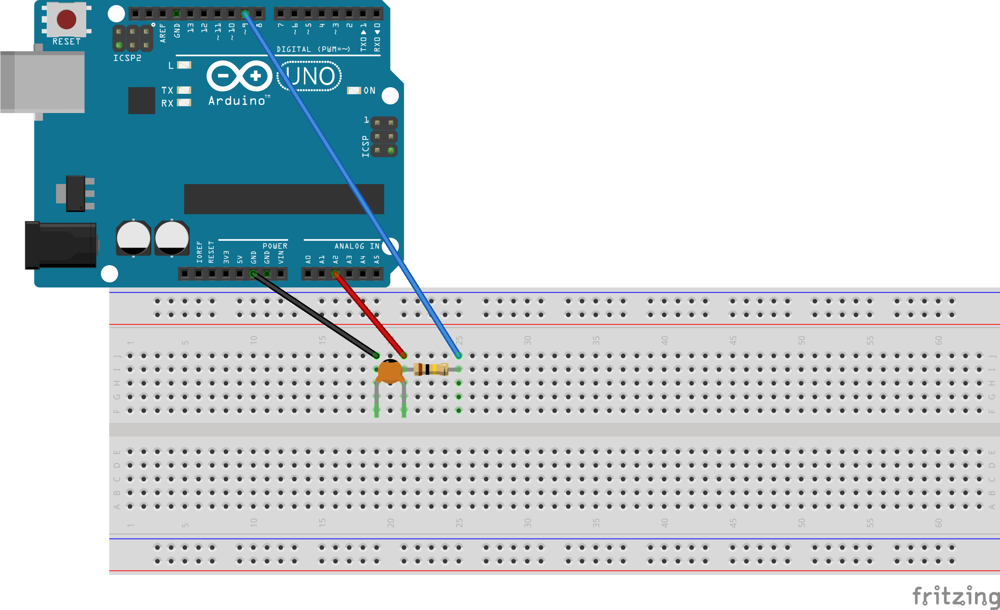

# Description and Specifications

## Circuit

The circuit scheme is shown below

  

* **Capacitor range for a good accuracy** : 1 nF - 1 &mu;F
* **Resistor value** : 100 k&Omega;   

​	

## Working principle
The basic idea is to measure the time constant &tau; in order to get the unknown capacitance as

​														 

Nevertheless, a single time measurement depends upon the bias voltage (which depends strongly on your laptop!) and the discharge time. It clearly depends on Rs as well. Hence, measuring two time instants is a much better idea

})

as now it only depends upon the distance T between the time instants (fixed) and .

## Code description

Since the time between the two measurements needs to be accurate, we can't just rely on Arduino built-in functions. In other words, registers must be directly manipulated. Here's the list of the involved ones:

* OCR1A, OCR1B : to set A/D conversion thresholds

* TCCR1A, TCCR1B, TCCR1C : to set prescaler, force commutation, toggle Pin

* TCNT1 : to set start value

* TIFR1, TIMSK1 to enable interrupts

* ADCSRA : to enable hardware triggers and set Prescaler 

* ADCSRB : sto start timer 1

  

