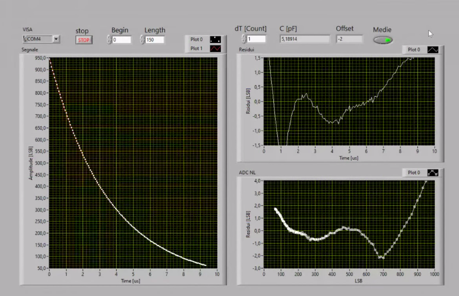
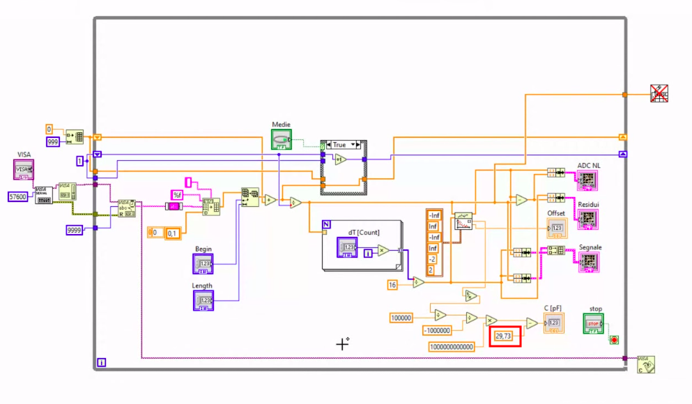

# Description and Specifications

## Circuit

For all the three versions of this project, the circuit scheme is shown below

  

* **Capacitor range for a good accuracy** : 

  > 1 nF - 1 &mu;F  
  >
  > 1 pF - 1 &mu;F ("advanced" version, which **requires LabView**) 

* **Resistor value** : 100 k&Omega;   

​	**NOTICE** : do not forget that both the resistor and the capacitor have their own tolerance which will definitely affect the accuracy of your measurement. Thereby, you should use a 1% resistor for a better result. In addition, keep in mind that you won't get the nominal value of your capacitor if you're not using a precise one, e.g. the "real value"  for a 20% 10 nF capacitor is in the range  8 - 12 nF. Do not expect to read the exact nominal value if your component has a huge tolerance.  

## Basic Version

### working principle

The basic idea is to measure the time constant  in order to get the unknown capacitance as

​														 

Nevertheless, a single time measurement depends upon the bias voltage (which depends strongly on your laptop!) and the discharge time. It clearly depends on  as well. Hence, measuring two time instants is a much better idea

})

as now it only depends upon the distance T between the time instants (fixed) and .

For a better result, averaging more measurements is a good idea.

### Code Description

Since the time between the two measurements needs to be accurate, we can't just rely on Arduino built-in functions. In other words, registers must be directly manipulated. Here's the list of the involved ones:

* OCR1A, OCR1B : to set A/D conversion thresholds
* TCCR1A, TCCR1B, TCCR1C : to set Prescaler, force commutation, toggle Pin
* TCNT1 : to set start value
* TIFR1, TIMSK1: to enable interrupts
* ADCSRA : to enable hardware triggers and set Prescaler 
* ADCSRB : to start timer 1

## Advanced Version

This advanced version employs both Arduino and LabView (and the knowledge of the Dithering in the probabilist model). 

### Arduino Program 

The Arduino program only requires two slight fixes to maximize the sampling frequency  keeping the maximum resolution ( < 200 kHz) as well in order to acquire many more points of the discharge curve to process them via LabView :

* threshold A to toggle the charge/discharge pin

* threshold B to sample 

We only keep 1 out 2 samples and increase threshold B every two samples.

### LabView 

To efficiently employ dithering, the noise network (50 Hz) must be unrelated with respect to the sampling period. Hence T must be a prime multiple of the system clock, e.g. 21013.

To reduce the offset error, we can employ an exponential fitting . Here's the front panel and the LabView G language program.

  

  

### Calibration

For a better accuracy, you should calibrate your system the very first time: the measured capacitance if you remove the capacitor stays in the 30 pF ballpark. The reason why you don't measure 0 is the S&H capacitor inside Arduino. In other words, you're measuring the parallel between the S&H capacitor and your capacitor, but you really notice it when you measure small capacitances as 30 pF is negligible for C >  500 pF.   

Hence,  you should at first measure at no capacitor and then insert the measured constant  in your LabView Program (in the red box). In my case, it's 29.73. Now you're ready to measure! 