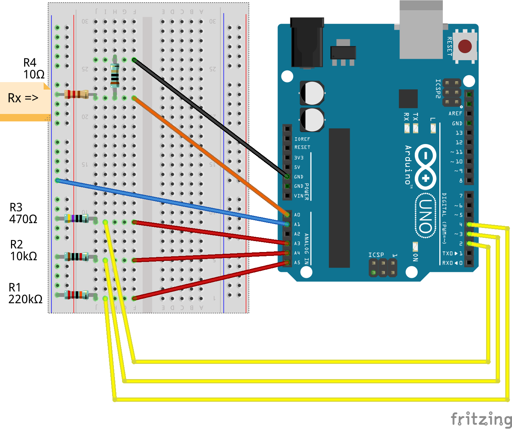

# Description and specifications

## Circuit

The circuit scheme is shown below 

  

## Architecture Description

This is an auto-ranging Ohmmeter. The details on the values of the components are described in the following sections. Here's a quick description of the architecture: three resistors connected to the three digital pins. The Ohmmeter automatically chooses the best range. 

The red wires allow to directly measure the voltage which proves really useful for small resistor measurements as Arduino might not be able to actually provide the necessary current to reach 5 V and we would make a mistake in the measurement. 

The 10 &Omega; resistor and the extra wire on the analog pin A0 allow to measure the actual voltage on the ground pin which might not really be 0 V for small resistor measurements. This  prevents additional offset errors in the measurement.

## Specifications

* allowed range : 10 &Omega; - 10 M&Omega; 
* accuracy in the 100 &Omega; - 1 M&Omega; range : 2.5 %
* minimum speed : 1 measure/s
* displays absolute uncertainty
* recognizes E24 resistors

## Working Principle 

The basic idea of a microcontroller based Ohmmeter is well-known : a voltage divider. Nevertheless, a single range is definitely not enough!

As a matter of fact, the purpose is both to respect the accuracy requirements and keep the circuit simple. For this reason, a preliminary analysis must deal with how many ranges are required at minimum. Clearly, the more the number of ranges increases, the more accurate   your Ohmmeter gets, but we want the simplest possible architecture to fit the requirements.

as for the resolution error, using the error propagation formulas

})

plotting this function we get a minimum at N = 512 LSB. Since we're using 1% resistors, the ADC error must be less or equal to 1.5%. Since the resolution is half of the ADC error, we must stay under the 0.75% : a single range won't work! We need at least 3 ranges whose upper limits are 

We end up with three parabolas.

With this choice, the maximum ADC error is equal to 

 The chosen ranges to get the optimum solution are

100 &Omega; x 5 = 500 &Omega;   &rarr; 470 &Omega;

470 &Omega; x 5 x 5 = 11750 &Omega;   &rarr; 10 k&Omega;

10 k&Omega; x 5 x 5 = 250 k&Omega;   &rarr; 220 k&Omega;

## Code Description

Coming soon
