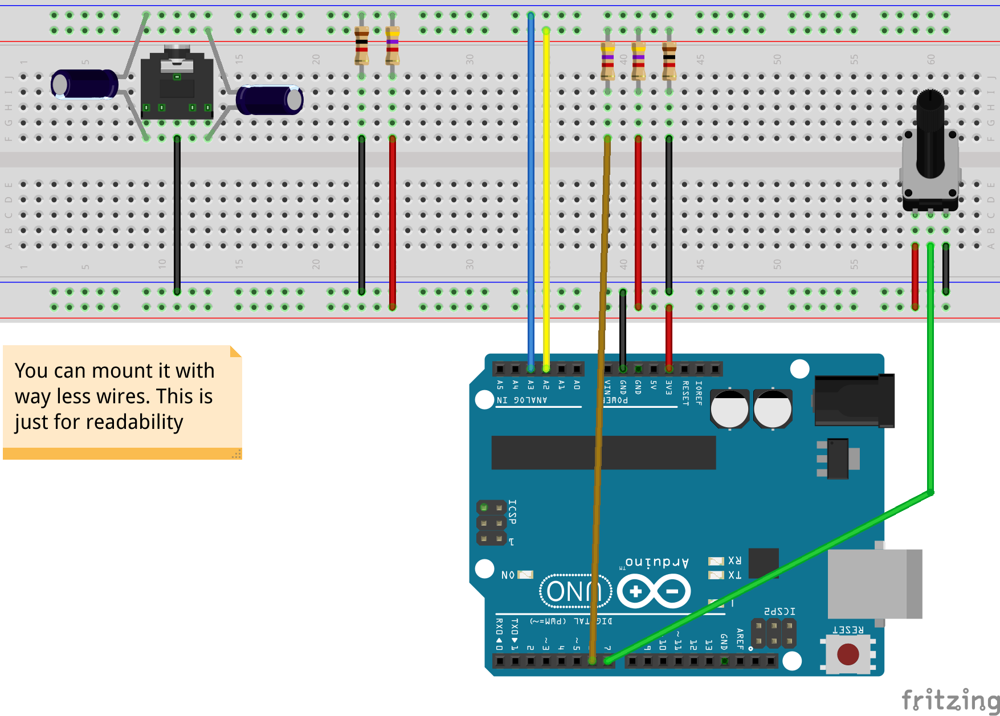

This project requires LabView.

## Circuit 

The scheme of the circuit is shown below

  

### Components

* 3x 4.7 k&Omega; resistor
* 2x 1 k&Omega; resistor
* 2x 1 &mu;F resistor
* 1x 22 k&Omega; potentiometer
* 1x 3.5 mm audio jack

### How to use 

* A3 : Channel 2
* A2 : Channel 1

* Potentiometer : Trigger
* audio jack : input audio source

## Code Description

