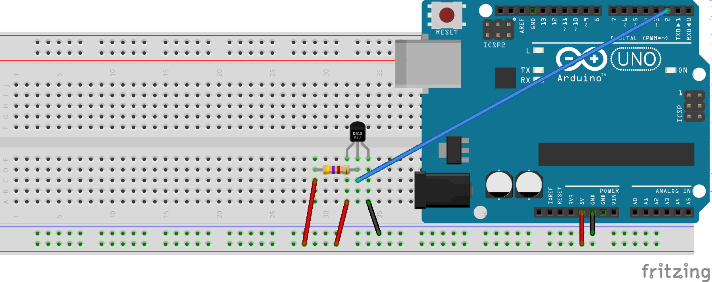

# Description and Specifications

## Circuit

The circuit scheme is shown below

  

* **resistor value** : 4.7 k&Omega;
* **temperature sensor** : DS18B20

## Code 

Two available versions of this project : 

- high level solution using Arduino libraries (useless for teaching purposes) 

- registers level solution, i.e. directly manipulating your Arduino microcontroller 

## Low Level Solution 

The communication relies on three commands 

* 0xCC : to start communication with sensor
* 0x44 :  to start a measurement 
* 0xBE : to request a measurement

### bus reset

The bus is firstly reset changing the direction of the corresponding pin to output and then to input with 1 ms delay.

### Bit transmission

The pin is firstly redirected to output for  1 us and then to input for 100 us. Notice that Arduino built-in functions (digitalWrite, pinMode)  are too slow for this purpose. We must directly manipulate registers then. 

### Bit reading 

The pin is firstly redirected to output for 1 us then 8 us delay before reading. Eventually, wait for 92 us .

### Decoding measurement

With 12 bits resolution, the read temperature is equal to 

